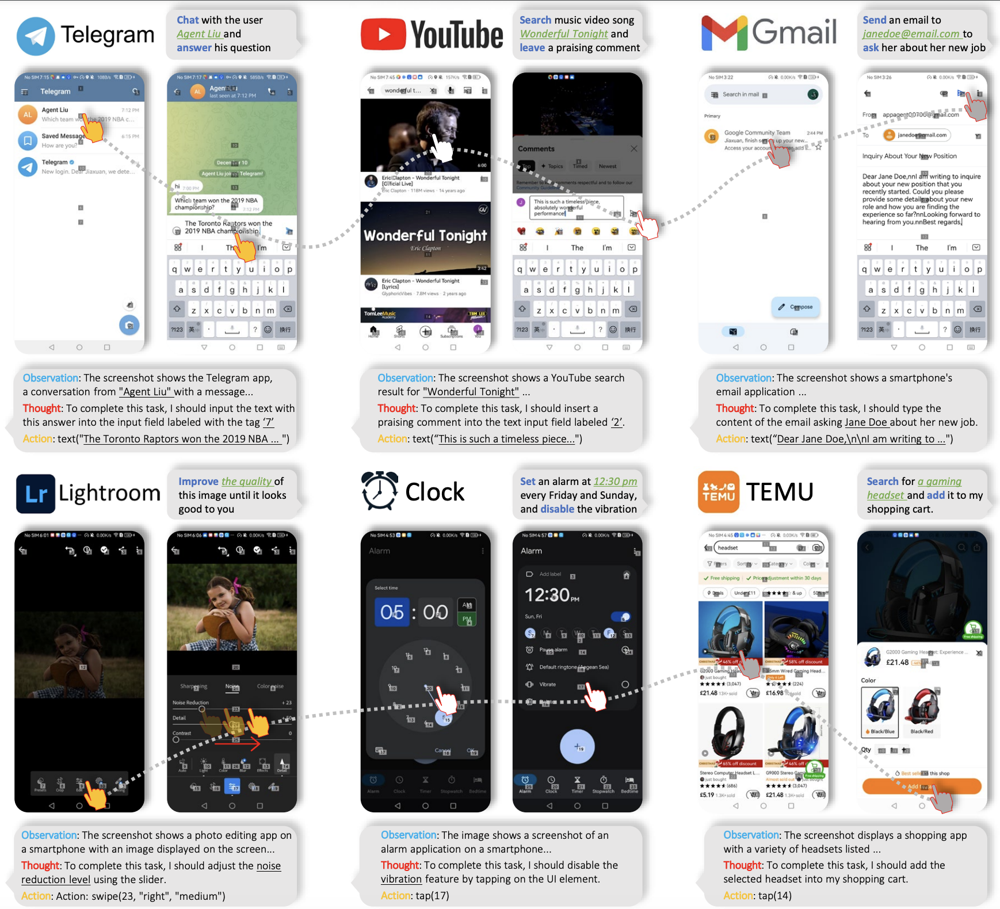
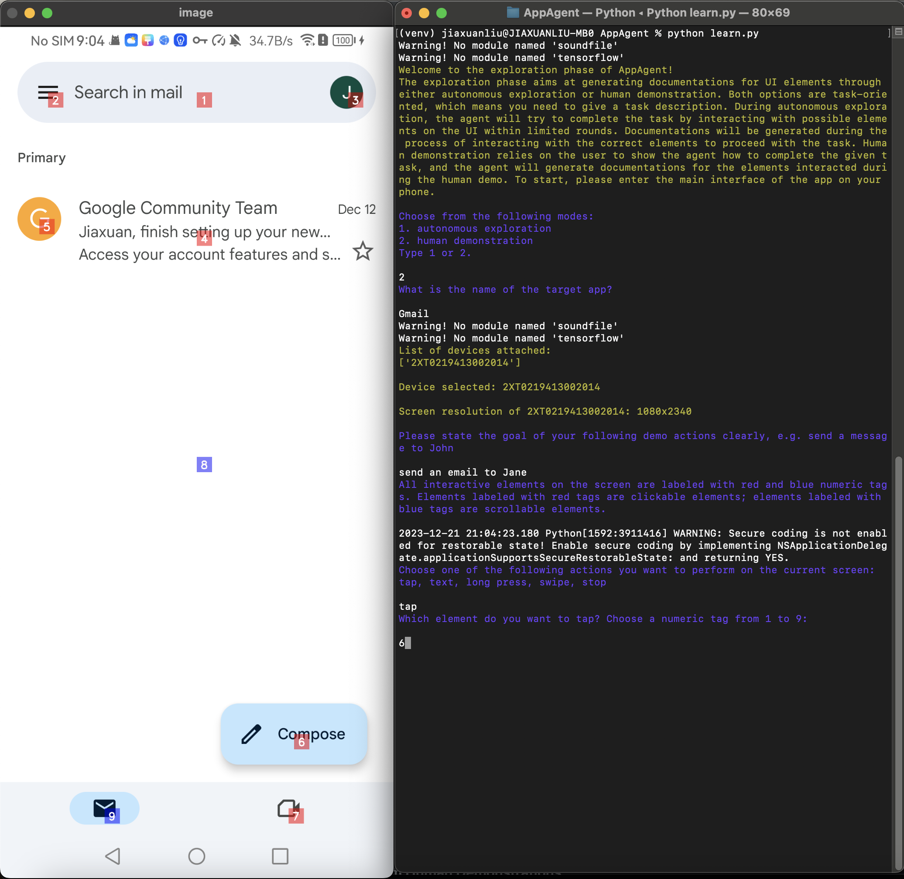

# AppAgent

<div align="center">

<a href='https://arxiv.org/abs/2312.13771'></a> &nbsp;&nbsp;&nbsp;&nbsp;&nbsp;
 <a href='https://appagent-official.github.io'></a> &nbsp;&nbsp;&nbsp;&nbsp;&nbsp;
 <a href='https://github.com/buaacyw/GaussianEditor/blob/master/LICENSE.txt'></a> &nbsp;&nbsp;&nbsp;&nbsp;&nbsp;
 <a href="https://twitter.com/dr_chizhang"></a> &nbsp;&nbsp;&nbsp;&nbsp;&nbsp;
 <br><br>
 <!-- [](https://huggingface.co/listen2you002/ChartLlama-13b) &nbsp;&nbsp;&nbsp;&nbsp;&nbsp; 
[](https://huggingface.co/datasets/listen2you002/ChartLlama-Dataset) -->

[**Chi Zhang***†](https://icoz69.github.io/), [**Zhao Yang***](https://github.com/yz93), [**Jiaxuan Liu***](https://www.linkedin.com/in/jiaxuan-liu-9051b7105/), [Yucheng Han](http://tingxueronghua.github.io), [Xin Chen](https://chenxin.tech/), [Zebiao Huang](),
<br>
[Bin Fu](https://openreview.net/profile?id=~BIN_FU2), [Gang Yu✦](https://www.skicyyu.org/)
<br>
(* equal contributions, † Project Leader, ✦ Corresponding Author )
</div>




ℹ️Should you encounter any issues⚠️ while using our project, please feel free to report them on [GitHub Issues](https://github.com/mnotgod96/AppAgent/issues) or reach out to Dr. Chi Zhang via email at dr.zhang.chi@outlook.com.


## 🔆 Introduction

We introduce a novel LLM-based multimodal agent framework designed to operate smartphone applications. 

Our framework enables the agent to operate smartphone applications through a simplified action space, mimicking human-like interactions such as tapping and swiping. This novel approach bypasses the need for system back-end access, thereby broadening its applicability across diverse apps.

Central to our agent's functionality is its innovative learning method. The agent learns to navigate and use new apps either through autonomous exploration or by observing human demonstrations. This process generates a knowledge base that the agent refers to for executing complex tasks across different applications.

## 📝 Changelog
- __[2024.1.2]__: Added an optional method for the agent to bring up a grid overlay on the screen to tap/swipe anywhere on the screen.
- __[2023.12.26]__: Added [Tips](#tips) section for better use experience; added instruction for using the Android Studio emulator for
  users who do not have Android devices.
- __[2023.12.21]__: 🔥🔥 Open-sourced the git repository, including the detailed configuration steps to implement our AppAgent!

## ✨ Demo

The demo video shows the process of using AppAgent to follow a user on X (Twitter) in the deployment phase.

https://github.com/mnotgod96/AppAgent/assets/40715314/db99d650-dec1-4531-b4b2-e085bfcadfb7

An interesting experiment showing AppAgent's ability to pass CAPTCHA.

https://github.com/mnotgod96/AppAgent/assets/27103154/5cc7ba50-dbab-42a0-a411-a9a862482548

An example of using the grid overlay to locate a UI element that is not labeled with a numeric tag.

https://github.com/mnotgod96/AppAgent/assets/27103154/71603333-274c-46ed-8381-2f9a34cdfc53

## 🚀 Quick Start

This section will guide you on how to quickly use `gpt-4-vision-preview` as an agent to complete specific tasks for you on
your Android app.

### ⚙️ Step 1. Prerequisites

1. On your PC, download and install [Android Debug Bridge](https://developer.android.com/tools/adb) (adb) which is a
   command-line tool that lets you communicate with your Android device from the PC.

2. Get an Android device and enable the USB debugging that can be found in Developer Options in Settings.

3. Connect your device to your PC using a USB cable.

4. (Optional) If you do not have an Android device but still want to try AppAgent. We recommend you download
   [Android Studio](https://developer.android.com/studio/run/emulator) and use the emulator that comes with it.
   The emulator can be found in the device manager of Android Studio. You can install apps on an emulator by
   downloading APK files from the internet and dragging them to the emulator.
   AppAgent can detect the emulated device and operate apps on it just like operating a real device.

   

5. Clone this repo and install the dependencies. All scripts in this project are written in Python 3 so make sure you
   have installed it.

```bash
cd AppAgent
pip install -r requirements.txt
```

### 🤖 Step 2. Configure the Agent

AppAgent needs to be powered by a multi-modal model which can receive both text and visual inputs. During our experiment
, we used `gpt-4-vision-preview` as the model to make decisions on how to take actions to complete a task on the smartphone.

To configure your requests to GPT-4V, you should modify `config.yaml` in the root directory.
There are two key parameters that must be configured to try AppAgent:
1. OpenAI API key: you must purchase an eligible API key from OpenAI so that you can have access to GPT-4V.
2. Request interval: this is the time interval in seconds between consecutive GPT-4V requests to control the frequency 
of your requests to GPT-4V. Adjust this value according to the status of your account.

Other parameters in `config.yaml` are well commented. Modify them as you need.

> Be aware that GPT-4V is not free. Each request/response pair involved in this project costs around $0.03. Use it wisely.

If you want to test AppAgent using your own models, you should modify the `ask_gpt_4v` function in `scripts/model.py` 
accordingly.

### 🔍 Step 3. Exploration Phase

Our paper proposed a novel solution that involves two phases, exploration, and deployment, to turn GPT-4V into a capable 
agent that can help users operate their Android phones when a task is given. The exploration phase starts with a task 
given by you, and you can choose to let the agent either explore the app on its own or learn from your demonstration. 
In both cases, the agent generates documentation for elements interacted during the exploration/demonstration and 
saves them for use in the deployment phase.

#### Option 1: Autonomous Exploration

This solution features a fully autonomous exploration which allows the agent to explore the use of the app by attempting
the given task without any intervention from humans.

To start, run `learn.py` in the root directory. Follow the prompted instructions to select `autonomous exploration` 
as the operating mode and provide the app name and task description. Then, your agent will do the job for you. Under 
this mode, AppAgent will reflect on its previous action making sure its action adheres to the given task and generate 
documentation for the elements explored.

```bash
python learn.py
```

#### Option 2: Learning from Human Demonstrations

This solution requires users to demonstrate a similar task first. AppAgent will learn from the demo and generate 
documentations for UI elements seen during the demo.

To start human demonstration, you should run `learn.py` in the root directory. Follow the prompted instructions to select 
`human demonstration` as the operating mode and provide the app name and task description. A screenshot of your phone 
will be captured and all interactive elements shown on the screen will be labeled with numeric tags. You need to follow 
the prompts to determine your next action and the target of the action. When you believe the demonstration is finished, 
type `stop` to end the demo.

```bash
python learn.py
```



### 📱 Step 4. Deployment Phase

After the exploration phase finishes, you can run `run.py` in the root directory. Follow the prompted instructions to enter 
the name of the app, select the appropriate documentation base you want the agent to use and provide the task 
description. Then, your agent will do the job for you. The agent will automatically detect if there is documentation 
base generated before for the app; if there is no documentation found, you can also choose to run the agent without any 
documentation (success rate not guaranteed).

```bash
python run.py
```

## 💡 Tips<a name="tips"></a>
- For an improved experience, you might permit AppAgent to undertake a broader range of tasks through autonomous exploration, or you can directly demonstrate more app functions to enhance the app documentation. Generally, the more extensive the documentation provided to the agent, the higher the likelihood of successful task completion.
- It is always a good practice to inspect the documentation generated by the agent. When you find some documentation not accurately
  describe the function of the element, manually revising the documentation is also an option.


## 📖 To-Do List
- [ ] Open source the Benchmark.
- [x] Open source the configuration.

## 😉 Citation
```bib
@misc{yang2023appagent,
      title={AppAgent: Multimodal Agents as Smartphone Users}, 
      author={Chi Zhang and Zhao Yang and Jiaxuan Liu and Yucheng Han and Xin Chen and Zebiao Huang and Bin Fu and Gang Yu},
      year={2023},
      eprint={2312.13771},
      archivePrefix={arXiv},
      primaryClass={cs.CV}
}
```

## Star History

[](https://star-history.com/#mnotgod96/AppAgent&Date)


## License
The [MIT license](./assets/license.txt).
