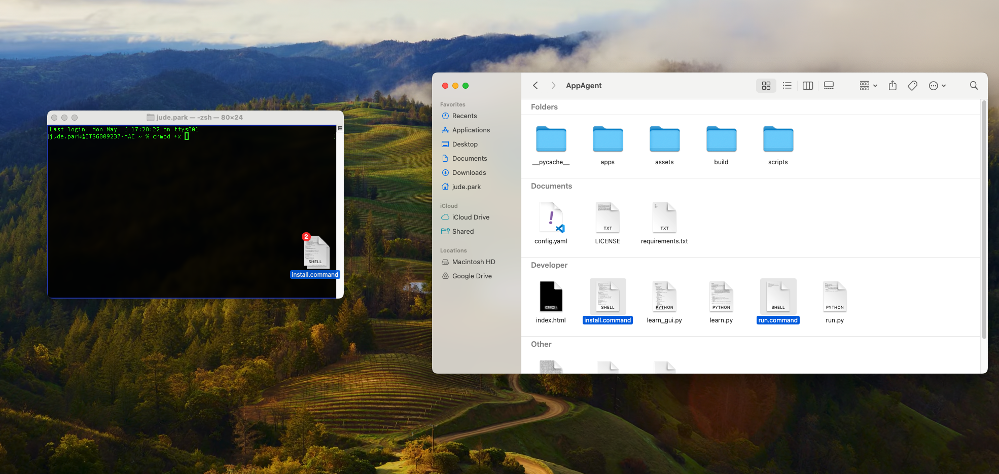
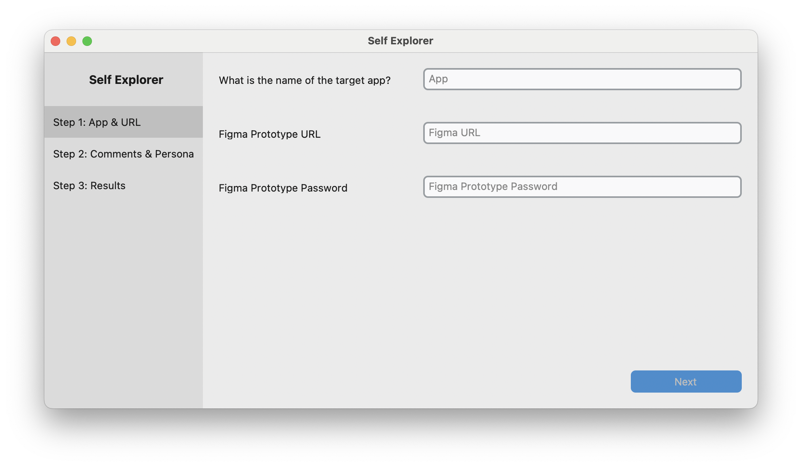

# Installation and Running Guide for Non-Engineers (Mac Users)

This guide is intended for non-engineers, such as designers, who wish to install and run the Figma AppAgent feature using the provided command files on a Mac.

## Installation

We provide `install.command` and `run.command` scripts to automate the installation and running processes. After downloading the scripts, you may need to give them execution permissions. This can be done by following these steps:

1. Open the Terminal app. You can find it in the Utilities folder within your Applications folder, or by searching for it in Spotlight.

2. In the Terminal, type `chmod +x ` (including the trailing space).

3. Drag and drop the `install.command` and `run.command` files from Finder into the Terminal window. The paths to the files will appear after the `chmod +x ` command.

4. Press Enter to execute the command.

Now, you can install the dependencies and verify the installation by double-clicking the `install.command` script. If the installation is successful, you will see the message "Installation successful." in the Terminal.

## Running the AppAgent

After successfully installing the dependencies, you can start the Figma AppAgent feature by double-clicking the `run.command` script. 

This will open the GUI, and you can start using the Figma AppAgent feature. The GUI provides a user-friendly interface for interacting with the Figma AppAgent feature, making it easy even for non-engineers to use.

**Note:** If you encounter any issues while running the scripts, make sure that you have the necessary permissions to execute the scripts and that Python 3 and pip are correctly installed on your system.

**For Windows and Linux users:** This guide is specifically for Mac users. If you are using Windows or Linux, please refer to the original README.md document for installation and running instructions.